# strongerV

'strongerV' is a website for those who are interested in sports and a healthy lifestyle. Its purpose is to show the other way of getting stronger, bigger or faster not only professional athletes, but also the ones who just like to train. The website is built including studies and real-life examples to show people that there are proofs of those studies.
The target is everyone, because who doesn't like to be healthy and full of energy? The website has no interest in selling products. It also offers a 10-day challenge with vegan recipes to prove to people that vegan food can work.

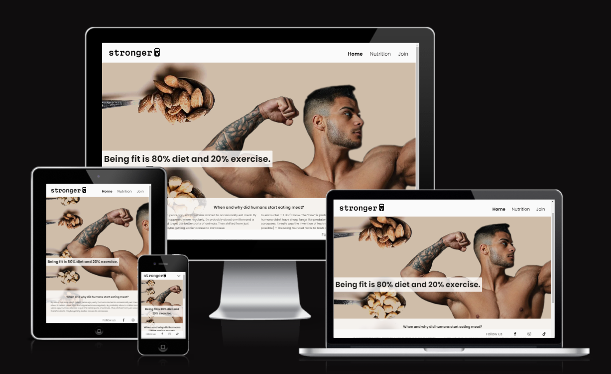

## Features

## Existing Features

+ Navigation bar
  + The navigation bar is to help the user to jump from one page to the other. It is there to make the experience easy without needing to depend on the back button on the browser or the phone.
  + The bar is fully responsive for mobile phones and bigger screens. The visitor can find a button on the right side of the screen of the phone which give a clear message that it is for the menu.

  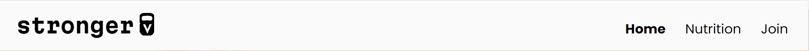

+ The background image
  + The background image shows spoons, full of nuts and most background colour is inspired by the colors of the nuts. There is a background colour behind the image in case it won't open in some browsers. Why nuts? Because most people think of vegetables and green colours when we talk about a plant-based diet. The idea behind it is to break the myth that vegan food includes only vegetables or that there is not enough protein in it. We want to show a great source of protein which is familiar to most of the people and slowly make them see the reality.

  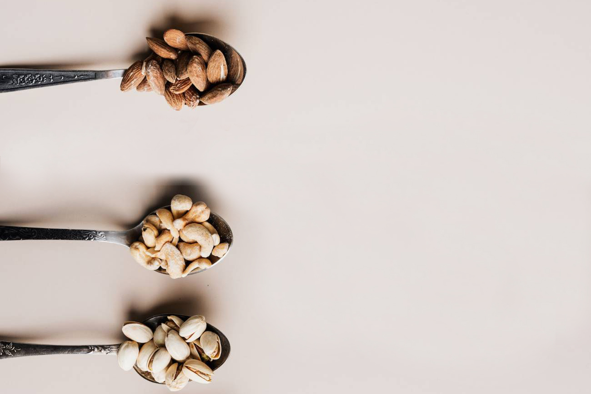

+ The landing page image
  + The hero image is meant to show that veganism is not about being slim, it is a matter of choice. Anyone can be as strong and as big as they would like. Its purpose is to prepare the reader to see not only studies but also strong athletes they already knew about. Maybe never thought that they were vegans. It follows with a quote which gives a clear message to the reader what to expect to read on this webpage however not revealing every detail there is.

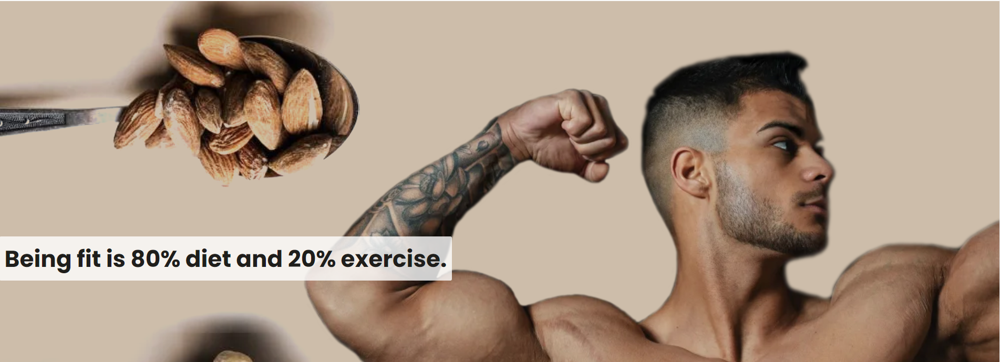

+ The intro section
  + In the intro section, the reader gets to know a bit about the history of the human diet which might rise some questions. If we did not eat meat then what did we eat? How did we survive? It's purpose is to slowly break the myth that humans are meat-eaters.

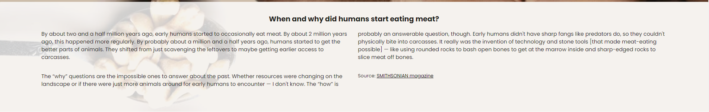

+ The footer section
  + On the footer section, the reader can find our Facebook, Instagram and pages there might be some pictures and stories of those people who did the transformation. The page is not there yet, however can be added in the future.

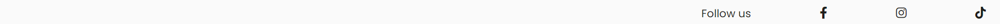

+ The Nutrition page

  This page had been divided in 4 main sections.

+ The first section is about gladiators as we want the readers to get interested in the vegan diet without even noticing it. This is the reason why the page starts with a small picture of a gladiator (at least how people imagine them to be) and a big heading saying that the strongest fighters were vegetarians. The reader can skip reading the text and jump to the next section, but the idea will be stuck in the head as everyone has heard legends about gladiators.

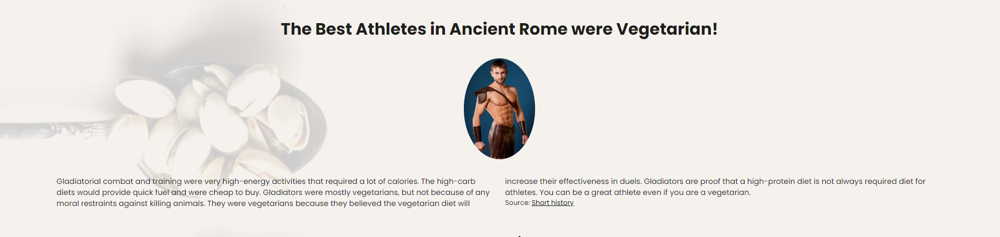

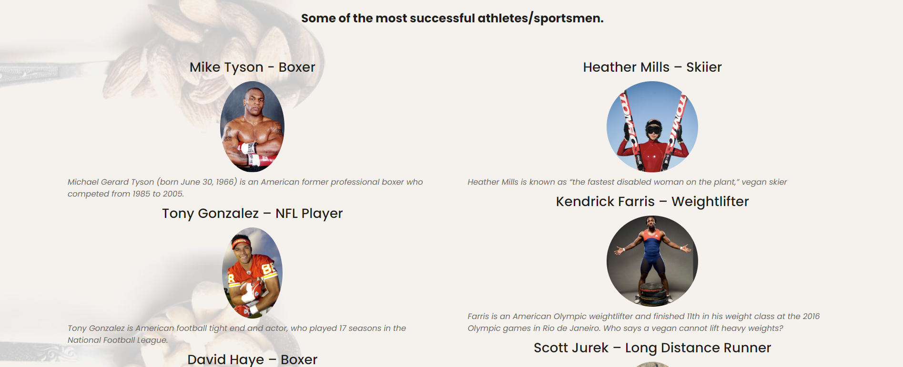

+ The second section compares plant and animal-based nutrition to give even more detailed reasons to do more research and give it a try. However, for those who wish to skip all these readings, there is a button which takes them to the last section where they can watch a documentary about athletes.

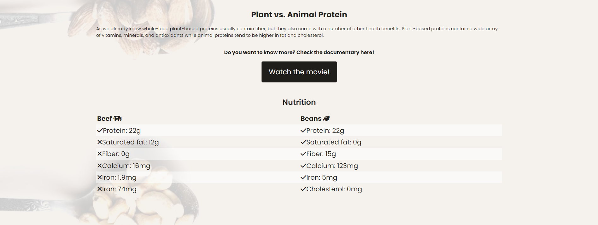

+ The third section is there for those who are more into reading and willing to discover the studies about our digestion system and our body.

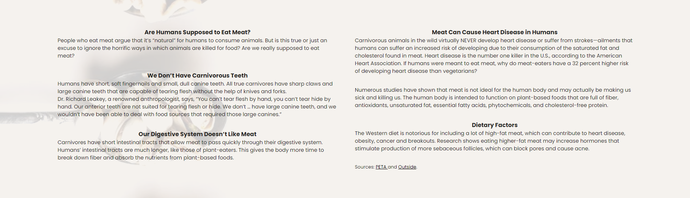

+ The fourth section is a documentary about successful athletes and how did they became vegan. They talk about their experience and how their lives have changed for the better after a plant-based diet.

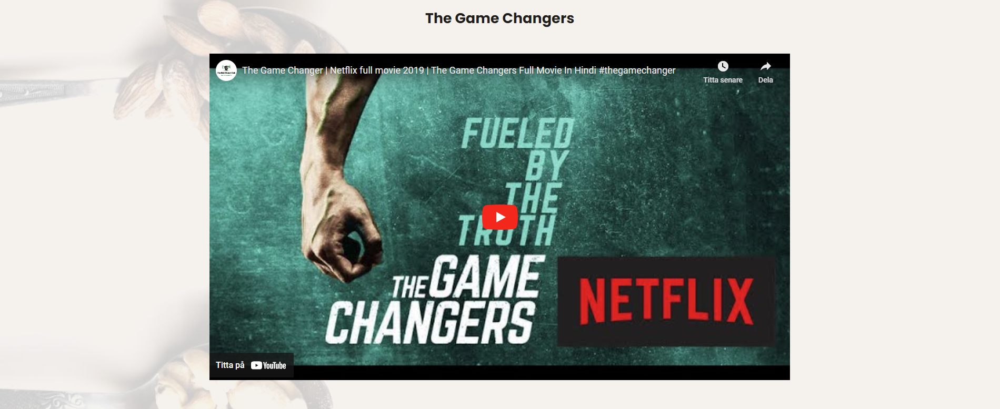

+ The Join page

 This page is where the website leads the reader to give it a try. It starts with a short info on what the reader can expect and a reason to join the page. On the bigger screens, the introduction is on the left side as people start looking first left and expect the next step to be on the right side. It leads the reader to find the ways the easiest and the most logical way. The buttons have a hover effect which helps to click the right button even if the person does not read the message on them. As usually green is associated with accepting and red is deleting, the buttons change the colours accordingly to green and red as well and the text becomes bold to get even more attention.

 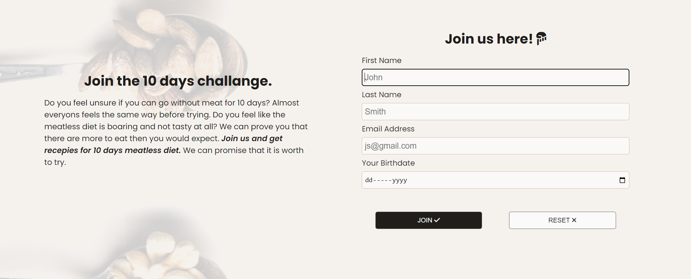

## Design and units

 As the reader comes to the first page there is no clear message that the page talks about vegan diet, except the small logo which had been created by me. The first impression is that there is some information on this webpage which will help me to get stronger. It has its purpose. The idea is to keep the visitor longer on the website and build trust.

 The Nutrition page has been divided into 4 sections visually, to make the reading easier and to keep people interested as they see some small contrast while scrolling.

 The units are mostly em, rem and % because it is the best way to make a webpage responsive. Because there are far too many screens, the best practice is to use relative units, which will prevent the webpage from looking crushed.

## Testing

+ All the links open in a new window and the work
+ All the buttons act as they supposed to
+ It is possible to play the video both on the website and to open it on YouTube
+ All the pictures are loading
+ The website works on Chrome, Firefox, Microsoft Edge and different mobile phones (tried at least 5 mobile phones)
+ The website is fully responsive
+ The form works as intended. The user can not join without a name or an email address
+ Had been checked the performance in lighthouse

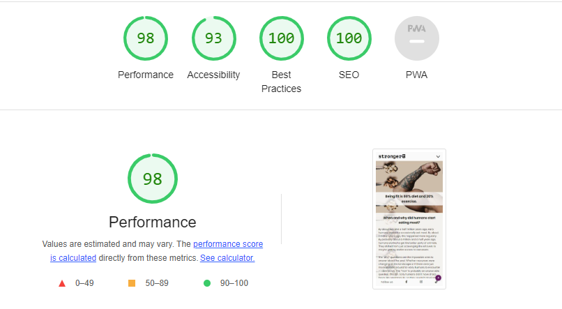

## Validator testing

Validating my index.html on validator.w3.org, found that I need to add a header on the div line 71. Fixed.

Validating my nutrition.html on validator.w3.org, found that I need to add headings to all articles. Fixed.

Validating my nutrition.html on validator.w3.org, found that I need to remove border="0" from iframe as HTML5 does not support it. Fixed.

Validating my nutrition.html on validator.w3.org, found that div can not be a direct child of a dl list. Made the div as a parent. The error is fixed.

Validating my nutrition.html on validator.w3.org, found that I forgot to remove one [ i ] tag from header on line 121. FIxed.

## Unfixed bugs

Imported fonts apperars to have problem.

The message - do not load in parallel.

Not possible to fix as it is copied from google.

## Deployment

+ The site was deployed to GitHub pages. The steps to deploy are following:
  + Open the Github repository and go to settings
  + From the source section select the Master Branch
  + Click on save then it will show that the deployment had been successfull.

The live link can be found here: [strongerV](https://asyaharoyan.github.io/stronger/index.html)

## Credits

### Content

+ The quote on the landing page has taken from [Readbubble](https://www.redbubble.com/i/art-board-print/Being-fit-is-80-diet-and-20-exercise-by-thebaig/113324954.NVL2T)
+ The text for the home page had bee taken from [Smithsonianmag.com](https://www.smithsonianmag.com/blogs/national-museum-of-natural-history/2021/12/09/meet-the-scientist-studying-how-humans-started-eating-meat/#:~:text=When%20and%20why%20did%20humans,the%20better%20parts%20of%20animals.)
+ The text about gladiators is taken from [Short-history.com](https://short-history.com/gladiator-vegetarian-diet-8dacefd7bc4a)
+ The list of the vegan athletes is taken from [Ranker.com](https://www.ranker.com/list/athletes-who-are-vegan/people-in-sports)and [Vegnews.com](https://vegnews.com/vegan-news/plant-vs-animal-protein-which-is-best)
+ The inspiration for the protein table of BEEF vs BEAN was taken from [Pinterest.com](https://www.pinterest.com/pin/195765915047202480/)
+ The third section about our digestion is taken from [Peta.org](https://www.peta.org/features/are-humans-supposed-to-eat-meat/)and [Cleaneatingmag.com](https://www.cleaneatingmag.com/clean-diet/5-foods-to-avoid-if-youre-worried-about-acne/?fbclid=IwAR1qk0p0AYYmYj_PoCNwOsNHP9KHFjAJFRjK158gn28RZ2oC_Xl0nsF7G2U)
+ The game changers iframe is taken from [Youtube.com/](https://www.youtube.com/)
+ The icons are from [Fontawesome.com](https://fontawesome.com/)

### Coding instroctions

+ The heder is inspired from LOVE RUNNING project
+ The used units mostly are em, rem and %. The instructios are taken from [Kevin Powell](https://www.youtube.com/watch?v=sifXs4XVK7g)
+ The instroctions for making the page in 2 columns are taken from [Kevin Powell](https://www.youtube.com/watch?v=nJfrThH92WU)
+ The instructions for positioning iframe is taken from [blog.theodo.com](https://https://blog.theodo.com/2018/01/responsive-iframes-css-trick//2018/01/responsive-iframes-css-trick/)
  + Instead of trying to get things right using dev tools the iframe had been designed using padding method. This approach ensures that the iframe maintains its aspect ratio and adjusts responsively to different screen sizes without explicitly setting its width or height.
+ To make the background to repeat and blend the background color : [stackoverflow.com](https://stackoverflow.com/questions/18225388/background-image-not-repeating) and [Kevin Powell](https://www.youtube.com/watch?v=zHZRFwWQt2w&t=26s)

### Media

+ The logo-V is done by me using CorelDraw
+ The background picture is downloaded from [pixels.com](https://www.pexels.com/sv-se/sok/nuts/)
+ The hero picture is downloaded from [Unsplash.com](https://unsplash.com/photos/tM-AOYwCK_Y)
+ The gladiators picture is downloaded from [Pixabay.com](https://pixabay.com/photos/fighter-soldier-gladiator-armor-5463541/)
+ The pictures for the athletes are from [Google.com](https://www.google.com/search?q=pictures&sca_esv=573743071&tbm=isch&sxsrf=AM9HkKlSKBeC2-Vf8tcldnEbZlTgxmXRAA:1697451831599&source=lnms&sa=X&ved=2ahUKEwjHgcjrrPqBAxVyavEDHZ31DIwQ_AUoAXoECAIQAw&biw=1536&bih=707&dpr=1.25)
